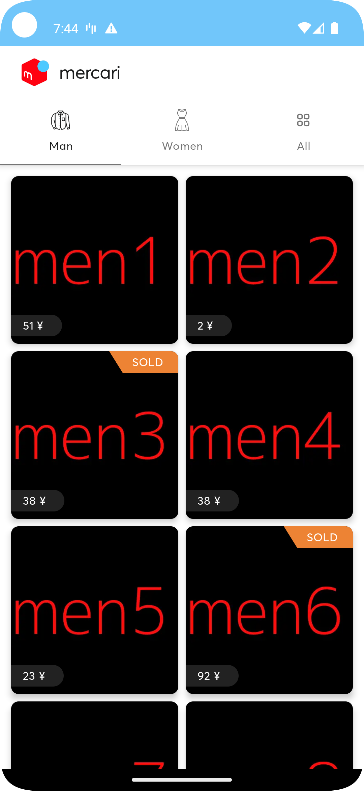
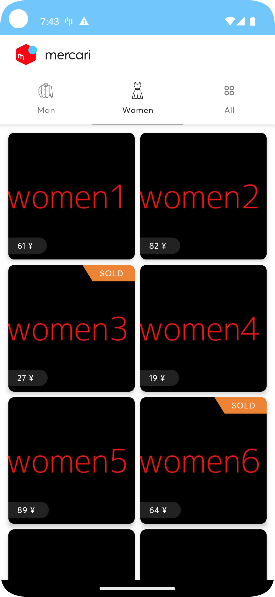
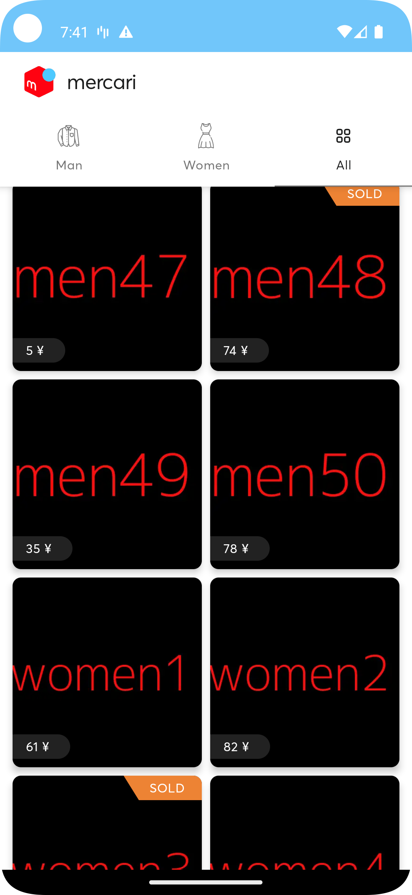

# Mercari-Clone
A clone app of Mercari.

### Architecture
- MVVM + MVI
- Clean Architecture
- [Layer -> Feature] Modularization (With Kotlin & Android Modules)

### Tech-Stack :
- Kotlin
- Jetpack Compose
- Coroutines
- Jetpack Lifecycle
- Dagger-Hilt
- Retrofit, OkHttp
- Kotlinx Serialization
#### Other :
- Splash Api
- Lottie
- Coil

Note* mercari and the mercari Logo are registered trademarks of [Mercari](https://www.mercari.com).

## Architecture Overview

    
    
    

